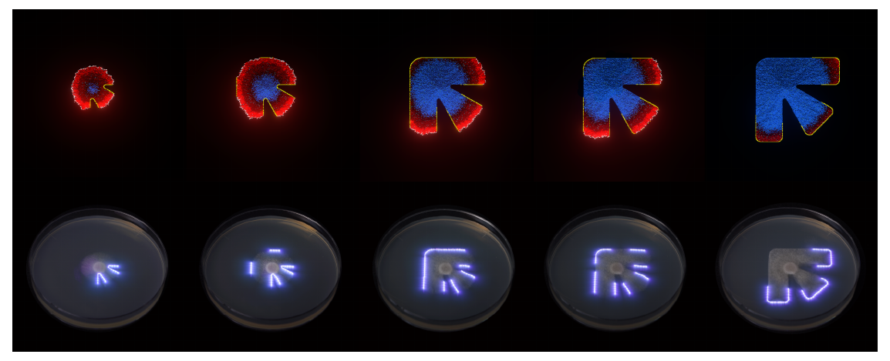

# FungalLight

中文 | [English](README.md)

[](Cargo.toml)
[](https://bevyengine.org/)
[](https://doi.org/10.1145/3680530.3695440)
[](https://arxiv.org/abs/2409.05171)
[](LICENSE)

这是与 SIGGRAPH Asia 2024 Art Papers 论文 **Exploring Fungal Morphology Simulation and Dynamic Light Containment from a Graphics Generation Perspective** 相关的 Bevy/Rust 真菌形态模拟原型。



## 项目功能

FungalLight 在二维网格中模拟真菌扩张过程，包含局部生长、资源消耗、限制边界与类光照反馈。它可以作为一个紧凑的交互式原型，用于探索如何将真菌形态生长理解为 graphic time-series generation 问题。

完整论文进一步将学习到的真菌扩张模式与现实世界中的激光边界控制连接起来。本仓库聚焦 Rust/Bevy 模拟部分：网格状态、生长规则、可视化反馈与 restriction mask 驱动的形态约束。

## 快速开始

```bash
git clone https://github.com/sunyitong/FungalLight.git
cd FungalLight
cargo run --release
```

程序会打开一个 Bevy 窗口，并从配置的初始位置开始生长模拟。

## 配置

当前原型会自动运行。核心参数位于 [`src/init_data.rs`](src/init_data.rs)：

| 常量 | 说明 |
| --- | --- |
| `CANVAS_SIZE` | 模拟网格大小与窗口分辨率。 |
| `RESTRICTION_IMAGE` | 用于定义生长边界的图像 mask。 |
| `FUNGI_INIT_POSITION` | 初始生长点。 |
| `FUNGI_STEP_DISTANCE` | 单步局部扩张距离。 |
| `LIGHT_LIFE_TIME` | 触碰边界后产生的光反馈持续时间。 |
| `*_COLOR` | 新生、存活、死亡、限制区域与光反馈的颜色。 |

## 仓库结构

```text
src/
  main.rs          Bevy 应用入口
  components.rs    ECS components 与 resources
  systems.rs       生长、生成、边界与光反馈系统
  init_data.rs     模拟参数
assets/images/     mask 与视觉资产
docs/assets/       README 图像资源
```

## 论文

- DOI：<https://doi.org/10.1145/3680530.3695440>
- arXiv：<https://arxiv.org/abs/2409.05171>
- 项目页：<https://yitongsun.com/fungal-simulation>

## 引用

如果你使用或改造了本模拟器，请引用：

```bibtex
@inproceedings{Wang_2024,
  title={Exploring Fungal Morphology Simulation and Dynamic Light Containment from a Graphics Generation Perspective},
  DOI={10.1145/3680530.3695440},
  booktitle={SIGGRAPH Asia 2024 Art Papers},
  publisher={ACM},
  author={Wang, Kexin and He, Ivy and Li, Jinke and Asadipour, Ali and Sun, Yitong},
  year={2024},
  pages={1--8}
}
```

## 开发

```bash
cargo fmt
cargo clippy --all-targets --all-features
cargo test
```

## 许可证

本仓库采用 [MIT License](LICENSE)。
